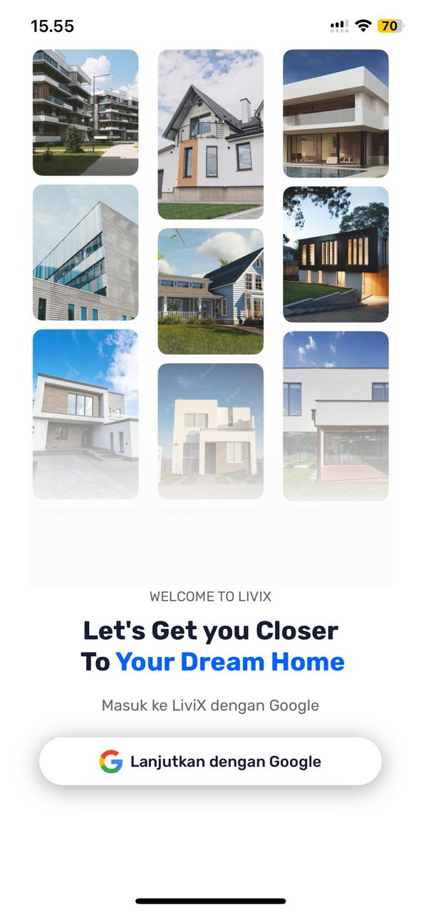
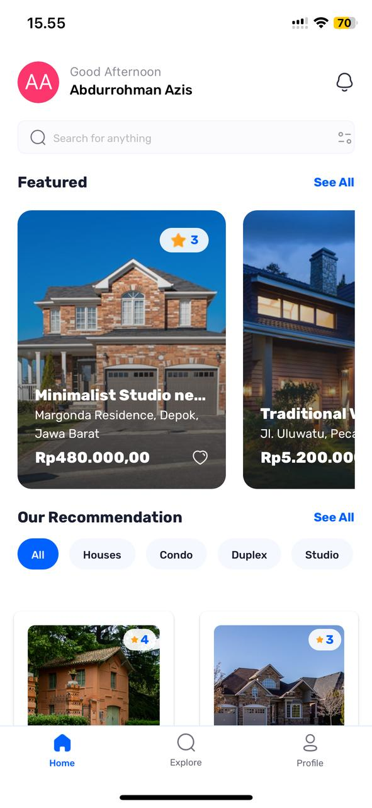
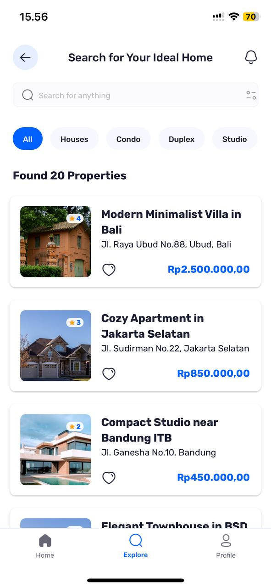
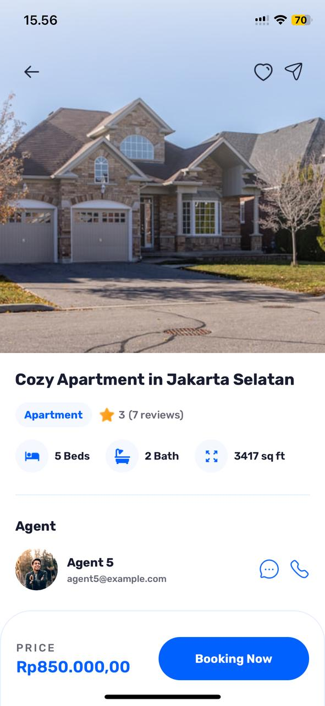

## 🤖 Introduction

Build a full-stack Real Estate application with React Native, featuring Google authentication, dynamic property listings, and user profiles. Designed with modern tools like Expo SDK 52, Appwrite, Tailwind CSS, and TypeScript for a seamless and scalable experience.

## ⚙️ Tech Stack

<ul>
   <li>Expo</li>
   <li>React Native</li>
   <li>TypeScript</li>
   <li>Nativewind</li>
   <li>Appwrite</li>
   <li>Tailwind CSS</li>
</ul>

## 🔋 Features

👉 **Authentication with Google**: Secure and seamless user sign-ins using Google’s authentication service.

👉 **Home Screen**: Displays the latest and recommended properties with powerful search and filter functionality.

👉 **Explore Screen**: Allows users to browse all types of properties with a clean and intuitive interface.

👉 **Property Details Screen**: Provides comprehensive information about individual properties, including images and key details.

👉 **Profile Screen**: Customizable user settings and profile management

## 📱 Screen Features

### - Login Screen

### - Home Screen

### - Explore Screen

### - Profile Screen

### - Detail Screen

